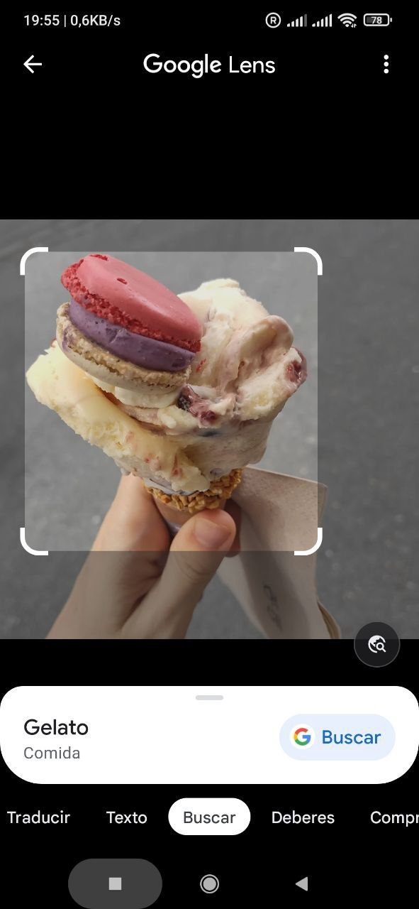

# PEC3: Visionando el futuro con las gafas de Manovich 

### Recurso de aprendizaje de Cultura Digital 

Autor: Yasmina González Torres

Fecha: 15/12/2022

 

## Introducción

En el libro “El software toma el mando” (2013), Manovich presenta su concepto de hibridación y nos pone varios ejemplos. En este reto se nos pide introducir y analizar dos casos de hibridación moderna, que podrían haber tenido cabida en el libro.
En primer lugar, voy a comenzar con una cita de su libro que creo que resume muy eficazmente el concepto de hibridación: 
“Las propiedades y técnicas únicas de diferentes medios se volvieron elementos de software que se pueden combinar de formas imposibles previamente.” (Página 148)

## Re-descubriendo la hibridación: Caso de Stable Diffusion 2

Stable Diffusion es una novedosa Inteligencia Artificial creada por StabilityAI, cuya primera versión fue lanzada en Agosto de 2022. Esta IA utiliza un modelo de aprendizaje profundo para generar una imagen de salida a partir de una entrada (txt2img) de texto proporcionada por el usuario, aunque no ha tardado en añadir más funciones como img2img, que permite darle una imagen y generarte otra relacionada, o funciones de escalado, retoque de imágenes y filtros.

La principal característica diferenciadora de esta IA es que es totalmente Open-Source, incluyendo todo su código fuente y los pesos generados durante el entrenamiento. Esto permite a cualquiera con un hardware suficiente instalarla en su ordenador y generar imágenes de forma independiente, pero no solo eso, si no que también cualquiera con los conocimientos suficientes puede modificarla, mejorarla o entrenarla por su cuenta, dándole un gran potencial para crecer.

La IA utiliza varios algoritmos de eliminación de ruido para ir mejorando la imagen, que comienza como ruido aleatorio, y que en cada una de las iteraciones va pareciéndose más a la imagen que le hemos pedido.

 

¿Por qué es un caso de hibridación?
Stable Difussion genera las imágenes a partir de una entrada de texto, que utiliza después para transformar y manipular los datos que ha aprendido durante su fase de entrenamiento para generar una imagen de salida. El modelo se ha entrenado a partir de millones de imágenes de todo tipo encontradas por Internet, por lo que claramente nos encontramos ante un caso de hibridación de manipulación de datos.
Todas las imágenes del conjunto de entrenamiento han sido analizadas y estudiadas por la IA, para después realizar combinaciones y transformaciones con ellas para generar otras nuevas.

 
 
Además de la hibridación que se consigue gracias a las posibilidades de la IA en sí, como generar imágenes a partir de texto, a partir de otras imágenes, o funciones extra como escalado, reducción de ruido e incluso creación de imágenes animadas, tenemos también la posibilidad de crear estilos híbridos, mezclando y combinando estilos de distintos autores o artistas. Por ejemplo, en la siguiente imagen se ve cómo he generado una imagen de la catedral de Notre Dame en estilo realista con el cielo de “La Noche Estrellada” de Van Gogh.

 
 
Sin duda creo que es una tecnología con un gran potencial para cambiar la forma de interpretar y crear arte. Estoy segura de que la aparición de este tipo de IAs va a suponer un antes y un después en la historia del diseño y la creatividad. Es muy posible que este tipo de herramientas todavía experimenten un gran proceso de mejora y refinamiento, y se comiencen a integrar en las “pipelines” de los flujos de producción de forma similar a lo que ocurrió en los años 90’s con herramientas como Adobe Photoshop o After Effects.

La innovación de este tipo de herramientas sin duda va a hacer posible la creación de nuevos estilos y flujos de trabajo, además de permitir que más personas sean capaces de mostrar su visión e interpretación de la realidad.
Para finalizar, cito algunas líneas de Manovich:
> “Una de las razones es que, en esta revolución, ningún nuevo medio per se fue creado. Justo como lo hicieron diez años antes, los diseñadores hacían imágenes fijas e imágenes en movimiento. Pero la estética de estas imágenes era ahora muy diferente.” — Página 221

## Re-descubriendo la hibridación: Caso de Google Lens

Google Lens es una herramienta de realidad aumentada y búsqueda visual desarrollada por Google y anunciada en el año 2017. Esta herramienta utiliza la Inteligencia Artificial para reconocer y entender las imágenes, de forma que puede identificar objetos, edificios, animales, plantas y muchas otras características en fotos y vídeos.

Su funcionamiento es bastante simple, puedes apuntar la cámara de tu teléfono hacia el objeto, y Google Lens analizará la imagen y mostrará información sobre lo que ve en ella. También puede reconocer textos, permitiendo copiarlos o traducirlos directamente sobre la imagen.

La herramienta además tiene la capacidad de aprender y mejorarse a sí misma gracias al aprendizaje automático y al análisis de imágenes ya clasificadas disponibles en Internet. De hecho, hay artículos que describen cómo Google utilizó sus famosos Captcha para entregar a su inteligencia artificial en el reconocimiento de imágenes (link artículo).

 

¿Por qué es un caso de hibridación?

Al igual que en el caso anterior, no podemos decir que se trate de un simple caso de multimedia. Google Lens es una herramienta muy completa que está cambiando la forma en la que nos relacionamos con la realidad. Es un ejemplo más de Realidad Aumentada, que nos permite observar el mundo real, pero añadiendo además una capa extra de información que se superpone a lo que vemos a simple vista.

Además, esta tecnología añade al mundo real la posibilidad de utilizar ciertas herramientas que, como dice Manovich, son propias del metamedio informático. Por ejemplo, gracias a Google Lens tenemos la opción de apuntar la cámara al texto de un cartel que veamos por la calle, y traducirlo directamente o incluso copiarlo y pegarlo en otra aplicación.

Sobre el tipo de hibridación, podemos decir que vuelve a tratarse de una hibridación de manipulación de datos, ya que nos permite en cierto modo digitalizar datos e información del mundo real, cambiando la forma en la que podemos interactuar y hacer uso de ellos. Además, la aplicación está integrada con otros servicios, ya que permite buscar los resultados directamente en el buscador de Google, lo que aumenta la versatilidad de la aplicación.
Sin embargo, en este caso creo que también podemos hablar de hibridación de la interfaz de usuario, ya que nos ofrece una nueva forma de interactuar con el mundo físico utilizando esta aplicación.

En mi experiencia personal, he utilizado Google Lens en múltiples ocasiones para obtener información detallada de cosas a mi alrededor. Por ejemplo, lo he usado para encontrar ropa similar a la que lleva una persona que veo por la calle (y que no voy a parar para preguntarle por ella), o para descubrir datos interesantes sobre plantas, árboles o insectos que me encuentro por la zona, permitiéndome saber el nombre de una raza de perro, el tipo de especie al que pertenece una planta o flor, o saber si ese insecto que se me ha colado en el salón puede picarme o no.

En general, creo que es una herramienta con mucho potencial y que seguramente reciba más funciones en el futuro.

### Referencias y Bibliografía

* Manovich, Lev. (2013). **El Software toma el mando**. Barcelona: Editorial UOC. 

----

Licencia: Material Creative Commons desarrollado bajo licencia CC BY-SA 4.0. Imágenes CC BY [Tubik studio](https://blog.tubikstudio.com/how-to-create-original-flat-illustrations-designers-tips/) 
